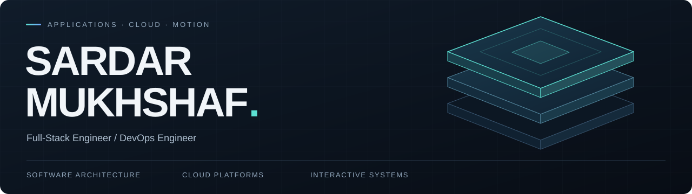

  

  <a href="https://sardarmukhshaf.com"><strong>Personel Portfolio</strong></a> &nbsp; / &nbsp;
  <a href="https://www.linkedin.com/in/sardar-mukhshaf/"><strong>LinkedIn</strong></a> &nbsp; / &nbsp;
  <a href="mailto:hello@sardarmukhshaf.com"><strong>Email</strong></a> &nbsp; / &nbsp;
  <a href="#selected-projects"><strong>Explore my work ↓</strong></a>

# Full Stack Engineer
# System & DevOps Engineer

I build applications and the infrastructure behind them: secure backends, interactive frontends, and automated cloud platforms. My work connects **software architecture, AWS infrastructure, and developer experience**, from PostgreSQL transactions and session security to Terraform modules and Kubernetes delivery workflows.

On the frontend, I work with **React, WebGL, and GSAP** to build motion-driven interfaces. On the platform side, I focus on **repeatable provisioning, controlled releases, and observable services**.

**Open to Cloud Engineering, DevOps, Platform Engineering, and Full-Stack opportunities.**

---

## Selected projects

Four entry points into my work. Each repository contains the implementation and its supporting documentation.

<table>
<tr>
<td width="50%" valign="top">

PLATFORM ENGINEERING

<h3><a href="https://github.com/sardar-mukhshaf/NEXUS">NEXUS</a></h3>

An internal developer platform that brings self-service infrastructure, GitOps, and software supply chain controls into one reference implementation.

<strong>Inside:</strong> Backstage service templates, Atlantis workflows, Argo CD applications, SOPS secrets, image-signing configuration, and runtime security tooling.

AWS EKS · Terraform · Backstage · Argo CD · Kyverno

</td>
<td width="50%" valign="top">

BACKEND ARCHITECTURE

<h3><a href="https://github.com/sardar-mukhshaf/real-state-api">Real Estate Management API</a></h3>

A Java and Spring Boot project of a property-management backend, structured as a modular monolith with explicit domain and persistence boundaries.

<strong>Inside:</strong> Rotating device sessions, transactional rental accounting, decimal money handling, Redis rate limits, private S3 storage, and integration tests.

Java · Spring Boot · PostgreSQL · Redis · Testcontainers

</td>
</tr>
<tr>
<td width="50%" valign="top">

SOFTWARE SUPPLY CHAIN

<h3><a href="https://github.com/sardar-mukhshaf/Silsila-Hardened-Pipeline">Silsila Hardened Pipeline</a></h3>

A secure software factory reference implementation covering source analysis, dependency and container scans, artifact traceability, and runtime detection.

<strong>Inside:</strong> CycloneDX SBOMs, Dependency-Track integration, Cosign/KMS signing workflows, Kyverno admission policies, and Falco detection rules.

GitHub Actions · Trivy · Syft · Cosign · Falco

</td>
<td width="50%" valign="top">

AUTOSCALING &amp; RELIABILITY

<h3><a href="https://github.com/sardar-mukhshaf/WhiteFriday-Engine">WhiteFriday Engine</a></h3>

An AWS e-commerce infrastructure project exploring capacity management, workload isolation, and service behavior under changing traffic.

<strong>Inside:</strong> Spot and On-Demand Karpenter pools, pod autoscaling, disruption budgets, load-test scenarios, chaos manifests, and cost dashboards.

AWS EKS · Karpenter · k6 · LitmusChaos · Grafana

</td>
</tr>
</table>

## More engineering projects

| Project | Engineering focus |
| :--- | :--- |
| **[NEZEN IDP](https://github.com/sardar-mukhshaf/NEZEN-IDP)** | Developer self-service with Backstage and Tekton; Terraform service modules, namespace quotas, team RBAC, Istio mTLS, and OPA/Gatekeeper policies. |
| **[Thabit Control Plane](https://github.com/sardar-mukhshaf/Thabit-Control-Plane)** | Infrastructure governance through Atlantis and Argo CD; SOPS/KMS secret workflows, Python/Lambda resource checks, SNS alerts, and break-glass runbooks. |
| **[SamaVault Platform](https://github.com/sardar-mukhshaf/SamaVault-Platform)** | AWS infrastructure for financial-services use cases; network segmentation, EKS, encrypted RDS, CloudTrail, S3 Object Lock, and configuration auditing. |
| **[Nazar Governance Mesh](https://github.com/sardar-mukhshaf/Nazar-Governance-Mesh)** | Jenkins delivery workflows for TypeScript applications; SonarQube checks, container scanning, ECR publishing, GitOps manifest updates, EKS, and Aurora PostgreSQL. |
| **[Terraforms Ecom](https://github.com/sardar-mukhshaf/Terraforms-Ecom)** | Eight reusable AWS Terraform modules spanning VPC, IAM, EKS, RDS, ALB, ECR, S3, and CloudWatch, with separate development and production configurations. |
| **[Wafi Transaction Platform](https://github.com/sardar-mukhshaf/Wafi-Transaction-Platform)** | Distributed commerce with Go, Java, and NestJS services; Kafka messaging, payment saga orchestration, an outbox publisher, and Kubernetes delivery assets. |
| **[SmogPrediction](https://github.com/sardar-mukhshaf/SmogPrediction)** | An air-quality application with prediction views, historical readings, analytics, and a Next.js/TypeScript interface. |

## Selected client work

| Project | My contribution |
| :--- | :--- |
| **[Enorus](https://enorus.com/)** | Website development, technical SEO, structured data, and Vite rendering and performance improvements. |
| **[AFKA Fitness](https://afka-fitness.enorus.com/)** | Backend authentication, JWT refresh-token rotation, session protection, and API rate limiting. |
| **[Ultimate Cricket Coaching](https://ultimatecc.enorus.com/)** | Full-stack delivery across the Node.js/Vite application, PostgreSQL data model, API security, and coaching workflows. |
| **[North Fades](https://northfades.enorus.com/)** | Migration from Laravel to Node.js, Express, React, and Vite, with clearer application boundaries. |

**[Personal portfolio — sardarmukhshaf.com](https://sardarmukhshaf.com/)**

An interactive frontend built with React, Vite, React Three Fiber, GSAP, and Lenis, combining a 3D hero, coordinated scroll sequences, and search-friendly rendering.

## Tools I work with

| Area | Technologies |
| :--- | :--- |
| **Cloud & infrastructure** | AWS · Terraform · Linux · Docker · Kubernetes · EKS · Helm · Karpenter |
| **Delivery & platforms** | GitHub Actions · Jenkins · GitLab CI · Argo CD · Atlantis · Tekton · Backstage |
| **Security & observability** | IAM · OIDC · RBAC · Istio · OPA · Kyverno · Trivy · Cosign · Prometheus · Grafana · Falco |
| **Backend & data** | TypeScript · Node.js · Express · NestJS · Java · Spring Boot · PostgreSQL · Prisma · Redis |
| **Frontend & motion** | React · Next.js · Vite · Tailwind CSS · GSAP · Framer-Motion · Three.js · React Three Fiber · Lenis |
| **Automation & validation** | Bash · Python · k6 · Locust · Testcontainers · Flyway · Infracost |

## How I approach engineering

- **Keep boundaries explicit.** Separate domain rules, application use cases, and infrastructure adapters so changes stay understandable.
- **Treat security as implementation work.** Define authorization, token lifecycle, workload identity, and admission policies in code.
- **Make changes reviewable.** Use versioned infrastructure, pull requests, automated checks, and documented recovery paths.
- **Measure behavior.** Use logs, metrics, and tests to investigate performance and failure modes.
- **Make interaction deliberate.** Use motion to guide attention, with accessible navigation and responsive behavior.

---

  <strong>Have a role or a project in mind?</strong> 
  <a href="mailto:hello@sardarmukhshaf.com">hello@sardarmukhshaf.com</a> &nbsp; · &nbsp;
  <a href="https://sardarmukhshaf.com">sardarmukhshaf.com</a>

